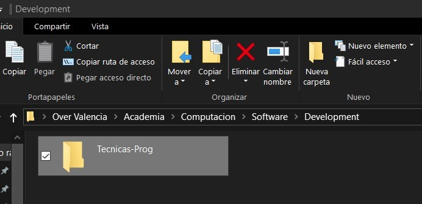

# Configuraciones finales

## Espacio de trabajo

Es importante tener un espacio de trabajo organizado y limpio para poder trabajar de manera eficiente y sin confusiones.
Lo normal es tener un directorio principal o carpeta donde se almacenen más carpetas definidas como proyectos independientes entre sí. En este curso, usaremos Visual Studio Code (VSC) como editor de código, por lo que es importante tener una estructura de carpetas clara y ordenada.

Lo primero que necesitamos es crear un directorio o carpeta donde ubicaremos todo el contenido y proyectos que desarrollemos en el curso. Para ello, sigue los siguientes pasos:

1. Pulsa `win + e`, busca un directorio cómodo para ti y crea una carpeta con un nombre reconocible.
   
   Copiamos la ruta de la carpeta.
2. Abrimos nuestro Visual Studio Code (VSC) y pulsamos `ctrl + k o`. Pegamos la ruta de la carpeta y pulsamos `enter`.
    

    ```{tip}
    Alternativamente puedes arrastrar la carpeta hasta el editor de código en VSC, al soltarla se abrirá dicha carpeta.
    ```

3. Sólo si confías en tí mismo, acepta la advertencia de confianza pulsando en **Sí, confío en los autores**.

4. Puedes comprobar con `ctrl + e` en el **Explorador de archivos** que has abierto el directorio padre.

```{dropdown} Desafío 00!
Vamos a generar un proyecto cuyo nombre será `Mini-Back`, al terminar debemos abrirlo. El reto está en hacerlo sólo por terminal.
```

## Extensiones de Visual Studio Code

Las extensiones de Visual Studio Code (VSC) son herramientas que nos permiten extender las funcionalidades del editor de código. Existen extensiones para todo tipo de lenguajes de programación, herramientas de depuración, control de versiones, entre otros.

Presionamos `ctrl + shift + x` para abrir la pestaña de **Extensiones** y buscamos las siguientes extensiones:

1. **Python** de Microsoft.
2. **Pylance** de Microsoft.
3. **Live Share** de Microsoft.
4. **Thunder Client** de Thunder Client.
5. **Code Runner** de Jun Han.
6. **Ruff** de Astral Software.
7. **Dotenv Official + Vault** de Dotenv.
