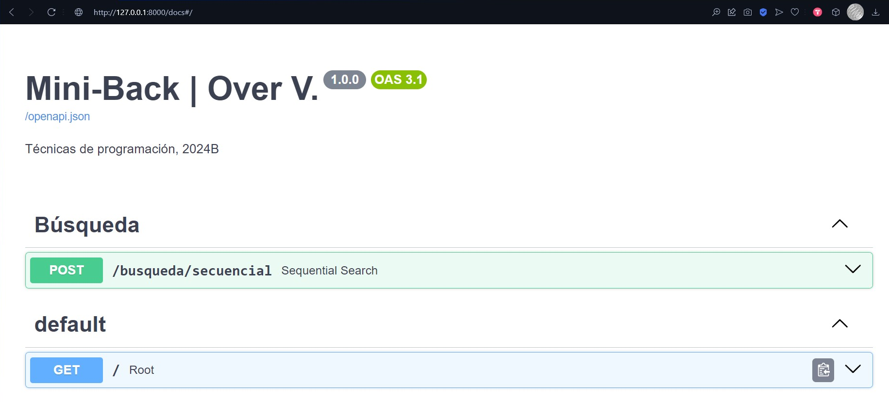
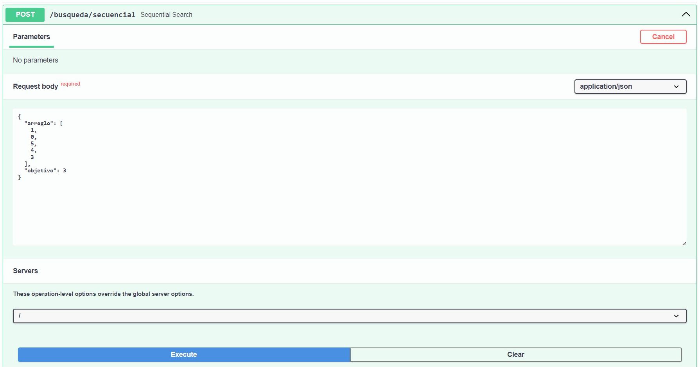

# Introducción a FastAPI

Ya que nos encontramos en la carpeta `Mini-Back`, vamos a entender FastAPI como un framework web moderno y rápido para crear APIs con Python 3.6+ *(3.6 en adelante)* basado en estándares abiertos y estándares de tipo de datos Python. Es fácil de aprender y usar, pero también es muy rápido y eficiente.

Lo primero que debemos hacer es configurar correctamente nuestro entorno de desarrollo, esto aplica para cualquier desarrollo que se realice en Python.

## Entorno virtual

Un entorno virtual es un directorio que tiene como función aislar todas las librerías, módulos y dependencias para un proyecto en particular. Esto se hace porque cada proyecto puede tener diferentes versiones de las librerías y módulos, y a veces pueden ser incompatibles entre sí.

Para crear un entorno virtual, debemos instalar la librería `virtualenv` que nos permitirá crear un entorno virtual. Para ello, abrimos una terminal y ejecutamos el siguiente comando:

```powershell
pip install virtualenv
```

Una vez instalado `virtualenv`, vamos a crear un entorno virtual en la carpeta `Mini-Back`. Para ello, ejecutamos el siguiente comando:

```powershell
python -m venv .venv
```

```{note}
Si usamos `ctrl + shift + p` y escribimos `Python: Create Environment`, seleccionamos la opción `Venv` (Virtual Environment) y finalmente la versión de Python que deseemos.
```

*El uso de `-m` es para especificar un módulo, en este caso `venv` que es el módulo que nos permite crear entornos virtuales y así no tomar otro módulo que se pueda llamar igual.*
Este comando creará un directorio llamado `.venv` en la carpeta `Mini-Back`. No obstante **debemos activar siempre** el entorno virtual *(se desactiva al cerrar el editor)*, ejecutamos el siguiente comando:

```powershell
.venv\Scripts\activate
```

Podremos notar cómo en la terminal aparece el nombre del entorno virtual activo, en este caso `(.venv)`. En caso se necesite desactivar el entorno virtual, se ejecuta el comando:

```powershell
deactivate
```

## Requerimientos

En desarrollos colaborativos, es importante tener un archivo que contenga todas las librerías y módulos que se necesitan para ejecutar el proyecto. Para ello, vamos a crear un archivo llamado `requirements.txt` en la carpeta raíz (`Mini-Back`) y vamos a agregar las siguientes librerías:

```text
fastapi
uvicorn
pydantic
python-dotenv
ruff
```

```{note}
En python 3.8+ se puede usar `pip freeze > requirements.txt` para habiendo ya instalado las dependencias, generar este archivo `requirements.txt` con todas las librerías instaladas en el entorno virtual.
```{dropdown} Más sobre versionamiento!
Si no especificamos la versión en las librerías, se instalará la última versión disponible.
Para especificar una versión exacta, se puede hacer de la siguiente manera:

```text
fastapi==0.68.0
uvicorn>=0.15.0,<=0.17.0
pydantic<1.8.2
python-dotenv>=0.19.0
ruff~=0.1.0
```

```{note}
La instalación de Python en un entorno virtual está aislada de la instalación global. Esto significa que los paquetes instalados en el entorno virtual no afectarán a la instalación global y viceversa.
```

Sabiendo que tenemos activado el entorno vitual, vamos a instalar las librerías y módulos necesarios para nuestro proyecto. Para ello, ejecutamos el siguiente comando:

```powershell
python -m pip install -r requirements.txt
```

En este indicamos que ejecutaremos el módulo `pip` de Python para instalar mediante una acción de lectura (`-r`) las librerías y módulos que se encuentran definidas en el archivo `requirements.txt`.

Esperamos a que se instalen todas las librerías y módulos necesarios para nuestro proyecto.

## FastAPI

FastAPI nos permite hacer desarrollos en la web usando Python, no obstante tiene dependencia de `uvicorn` para poder ejecutar el servidor. Para ello, vamos a crear un archivo llamado `main.py` en la carpeta raíz y vamos a agregar el siguiente código:

```python
from fastapi import FastAPI

app: FastAPI = FastAPI(
    title="Mini Backend | Mi Nombre.",
    summary="Técnicas de programación, 2024B",
    version="1.0.0",
)


@app.get("/")
def root() -> dict[str, str]:
    return {"data": "Hello algorithms!"}
```

```{dropdown} Directorio actual
```markdown
Mini-Back
├── .venv/
├── main.py
└── requirements.txt
```

Para ejecutarlo y ver el resultado, vamos a abrir una terminal y ejecutamos el siguiente comando:

```powershell
uvicorn main:app --reload
```

```{note}
El comando `uvicorn` nos permite ejecutar el servidor web, `main:app` indica que el archivo `main.py` contiene la instancia de FastAPI y `--reload` nos permite recargar el servidor cada vez que se realice un cambio en el código.
```

De esta forma, cuando abramos un navegador y vayamos a la dirección indicada, cual por defecto es `http://127.0.0.1:8000/`, la previamente mencionada dirección IP de Localhost, donde lo que precede a los dos puntos es el puerto *(8080)*.

Deberíamos ver el mensaje `{"data": "Hello algorithms!"}` en el navegador.

```{note}
Para detener el servidor, basta con presionar `ctrl + c` en la terminal.
```

Pero entonces, ¿Qué hemos hecho? Hemos creado un servidor web que nos devuelve un mensaje en formato JSON *(JavaScript Object Notation)*, en este caso `{"data": "Hello algorithms!"}` es un diccionario con clave `data` y valor `Hello algorithms!`, pero se convierte en JSON en el proceso de respuesta de forma forzosa. Ahora, la dirección a la que accedemos después del puerto `8080` la hemos dejado en blanco en nuestro navegador, además, hemos definido que ante una petición de tipo `GET` a la dirección raíz `/`, se ejecute la función `root`, es por esto que nos devuelve el mensaje mencionado.

FastAPI nos permite hacer desarrollos web de manera rápida y eficiente, además de ser fácil de aprender y usar.

```{warning}
Es importante conocer el sitio de Endpoints de FastAPI, este es conocido como `Swagger UI`, el cual nos permite ver y probar los endpoints de nuestra API. Para acceder a él, vamos a la dirección `http://localhost:8000/docs`.
```

```{dropdown}
🎉 Felicidades 🎊 Has construído tu primer aplicativo FastAPI 🥳 De aquí en adelante vienen conceptos para dar una arquitectura sostenible y escalable al aplicativo.
```

### Esquemas

Vamos a generar un nuevo archivo llamado `exec.py` al lado de `main.py` y vamos a agregar el siguiente código:

```python
import uvicorn


if __name__ == "__main__":
    uvicorn.run(
        app="main:app",
        host="127.0.0.1",
        port=8000,
        reload=True,
    )
```

En este definimos los parámetros sobre los que va a funcionar el servidor, en este caso iniciará el aplicativo en el archivo `main.py` con el objeto llamado `app` de tipo FastAPI en la dirección `localhost` y el puerto `8000`, además de recargar el servidor cada vez que se realice un cambio en el código.

Ahora creamos dos folders, uno llamado `routes` y otro llamado `schemas` dentro de un folder llamado `api`, en el de rutas creamos un archivo llamado `busqueda.py`, su objetivo es contener los algoritmos de búsqueda vistos en el curso, acá se podrá entender la implementación de al menos uno de ellos, `Sequential Search`.

El directorio actual debería verse de la siguiente manera:

```markdown
Mini-Back
├── .venv/
├── api/
│   ├── routes/
│   │   └── busqueda.py
│   └── schemas/
│       └── busqueda.py
├── main.py
├── exec.py
└── requirements.txt
```

Vamos a modificar sobre el esquema de `busqueda.py` para que contenga el siguiente código:

```python
from pydantic import BaseModel, ConfigDict, Field


class SolicitudBusqueda(BaseModel):
    arreglo: list[int] = Field(
        ...,
        title="Arreglo de enteros",
        description="Arreglo de enteros para buscar",
    )
    objetivo: int = Field(
        ...,
        title="Objetivo",
        description="Número a buscar en el arreglo de enteros",
    )
    model_config: ConfigDict = ConfigDict(
        title="Solicitud de búsqueda",
        description="Solicitud de búsqueda de un número en un arreglo",
        populate_by_name=True,
        json_schema_extra={
            "example": {
                "arreglo": [1, 0, 5, 4, 3],
                "objetivo": 3,
            }
        },
    )
```

En este definimos un esquema de tipo `BaseModel` *(Usado para crear modelos Pydantic)* que contiene un arreglo de enteros y un número objetivo. Todas las entradas en el cuerpo de datos se definirán con el objeto `Field`, este puede dejarse sólo como `Field(...)` pero por claridad se le ha añadido un título y una descripción, así mismo es importante definir los tipos de parámetros utilizados.

```{dropdown} ¿Cómo tipo en python?

Tipar en python es algo que siempre ha sido opcional, pero desde Python 3.5+ es posible tipar variables y funciones, esto con el fin de mejorar legibilidad y sobre todo, poder detectar errores o evitar infringir restricciones de nuestros datos.
La estructura es `nombre_variable: tipo = valor`, donde `tipo` es el tipo de dato que se espera y `valor` es el valor que se le asigna a la variable. En las funciones, se espera un tipo de dato de retorno, esto se define con `-> tipo_retorno` así mismo como los argumentos de la función `parametro: tipo` consecuentemente.

```python
from typing import Callable


# Variables básicas
mi_numero: int = 5
mi_cadena: str = "Técnicas!"
mi_flotante: float = 3.1416
mi_booleano: bool = True

# Colecciones
mi_lista_entera: list[int] = [1, 2, 3, 4, 5]
mi_diccionario_flotante: dict[str, float] = {"pi": 3.1416, "e": 2.7182, "phi": 1.6180}
mi_conjunto_booleano: set[bool, bool] = {True, False}
mi_tupla_cadena: tuple[str, ...] = ("Hola", "Mundo")


# Funciones
def suma(a: int, b: int) -> int:
    return a + b


# También se pueden tipar variables que contengan funciones
adicion: Callable[[int, int], int] = suma
resultado: int = adicion(5, 5)

# Así como se puede tipar con datos básicos, también se puede hacer con clases y funciones.
# Puedes probar a tipar colecciones más complejas como listas de diccionarios, diccionarios de listas, etc.

lista_de_diccionarios: list[dict[str, int]] = [{"a": 1, "b": 2}, {"c": 3, "b": 4}]
diccionario_de_listas: dict[str, list[int]] = {"a": [1, 2, 3], "b": [4, 5, 6]}
diccionario_de_diccionarios: dict[str, dict[str, int]] = {
    "a": {"b": 1, "c": 2},
    "d": {"e": 3, "f": 4},
}
conjunto_de_tuplas: set[tuple[str, int]] = {("a", 1), ("b", 2), ("c", 3)}

# Se recomienda aprender sobre los Diccionarios Tipados (TypedDict), una forma precisa para tipar diccionarios,
# delimitando lo que estos puedan recibir, evitando así errores o incertidumbres.
```

```{error}
Aunque se haga aplicación de un tipado a un objeto en python, una asignación indebida no generará error como en otros lenguajes, pero sí una advertencia que debemos atender.
```

Ahora, `model_config` no es un parámetro de entrada en de nuestra petición, sino que es un parámetro ajustable de BaseModel para ayudarnos a definir modelos, en este caso darle un título, descripción, permitir llenar los datos dándoselos a cada nombre pero, lo más importante, dar **un ejemplo** de cómo se vería la entrada de datos.

Añadimos ahora un esquema de respuesta en el mismo archivo `busqueda.py` dentro de la carpeta `schemas`:

```python
class RespuestaBusqueda(BaseModel):
    indice: int = Field(
        ...,
        title="Índice",
        description="Índice del número encontrado en el arreglo",
    )
    encontrado: bool = Field(
        ...,
        title="Encontrado",
        description="Indica si el número fue encontrado en el arreglo como True, si no, False",
    )
```

Hemos definido cómo es que un **Cliente** deberá enviarnos los datos y con qué estructura, nosotros como **Servidor** responderemos a esa petición. Este proceso es fundamental para la comunicación entre ambos, ya que si no se respetan las estructuras, no se podrá realizar la comunicación.

### Rutas

Debemos tener en cuenta que no es recomendado el aplicar lógica de negocio en una ruta, para ello más adelante se separará en otro módulo llamado `services`, pero por ahora con fin meramente demostrativo pasaremos a la implementación de la Búsqueda Secuencial en el archivo `busqueda.py` dentro de la carpeta `routes`:

Primero creamos el `router`, este contendrá todos los **endpoints** o puntos de acceso al dispositivo o Cliente que lo solicite. En este caso, vamos a definir un solo endpoint que será de tipo `POST` y que recibirá un objeto de tipo `SolicitudBusqueda` y devolverá un objeto de tipo `RespuestaBusqueda`.

```python
from fastapi import APIRouter, status
from api.schemas.busqueda import SolicitudBusqueda, RespuestaBusqueda

router = APIRouter()

@router.post(
    "/secuencial",
    status_code=status.HTTP_200_OK,
    response_model=RespuestaBusqueda,
)
def sequential_search(dto: SolicitudBusqueda):
    # Algoritmo aquí! #
    return RespuestaBusqueda(
        indice=-1,
        encontrado=False,
    )
```

Debemos modificar el archivo `main.py` para que importe las rutas que vamos a definir en el archivo `busqueda.py`, además de importar las librerías necesarias para poder hacer uso de FastAPI. Para esto haremos uso de la función `include_router` que nos permite incluir las rutas definidas en un archivo en particular.

```python
from fastapi import FastAPI

app: FastAPI = FastAPI(
    title="Mini Backend | Mi Nombre.",
    summary="Técnicas de programación, 2024B",
    version="1.0.0",
)

app.include_router(busqueda.router, prefix="/busqueda", tags=["Búsqueda"])

@app.get("/")
def root() -> dict[str, str]:
    return {"data": "Hello algorithms!"}
```

Finalmente hacemos ejecución de nuestro archivo `exec.py` y accedemos a la sección de docs.

```powershell
python exec.py
```

Ya no necesitamos ejecutar `uvicorn` directamente, ya que `exec.py` esta delegado como inicio del aplicativo, de forma que ejecuta `app` desde main el cual a su vez carga todas las rutas (incluídas) en vuestro navegador. El flujo finalmente termina cuando la ruta devuelve el objeto respuesta para que podamos verlo en el navegador.



### Análisis de Búsqueda Secuencial

La búsqueda secuencial o lineal es un algoritmo cual dado un arreglo desordenado o no de elementos diferentes, busca si un elemento dado está o no, si está devuelve el índice en el que se encuentra, si no, devuelve `-1`. Este algoritmo es de complejidad computacional temporal $T(n)\in O(n)$ *(lineal)*, es decir, su tiempo de ejecución es proporcional al tamaño del arreglo. en el peor escenario.

```{note}
No, no fue un typo, el argumento `dto` es una abreviación de `Data Transfer Object`, es una forma de referirse a un objeto que se utiliza para transferir datos entre subsistemas de una aplicación. En este caso, `dto` es el objeto que recibe la petición del Cliente y es el objeto que se envía como respuesta al Cliente.
```

Se manejará la siguiente entrada de datos:


```python
def sequential_search(dto: SolicitudBusqueda) -> RespuestaBusqueda:
    indice_sin_encontrar: int = -1
    for indice, entero in enumerate(dto.arreglo): # (idx, elem) <- enumerate(colection)
        if entero == dto.objetivo:
            return RespuestaBusqueda(
                indice=indice,
                encontrado=True,
            )
    return RespuestaBusqueda(
        indice=indice_sin_encontrar,
        encontrado=False,
    )
```

Para la resolución del problema haremos uso de un ciclo `for each`, en Python existe la función `enumerate` que nos permite recorrer una colección asociando un indice a cada elemento, nos devuelve una tupla donde primero obtenemos el índice y luego el elemento.
En cada iteración comparamos si el elemento es igual al buscado, si es así podemos devolver el índice e indicar que se ha encontrado con `True`, caso contrario a no encontrarlo, devolvemos `-1` e indicamos que no se ha encontrado con `False`.


```{note}
El uso de `enumerate` es muy común en Python, pero no es la única función que permite recorrer una colección y obtener tanto el índice como el valor de cada elemento, también podemos hacer uso de `zip`, `map`, `filter`, entre otros. Se invita fuertemente a investigar sobre estas funciones y cómo se pueden aplicar en Python.
```

```{dropdown}
**🎉 Enhorabuena 🎊**
Has hecho tu primera lógica en el Framework de FastAPI 🥳 Con esto tienes lo necesario para practicar aún más y explorar las distintas formas de manejar entradas de datos, definir esquemas y crear múltiples niveles de lógica en un aplicativo ¡Nos vemos hasta la próxima!
```
